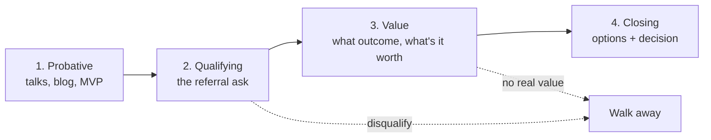

# The Four Conversations: Overview

A sale is not one event. It is four distinct conversations, in order, each with a different job, a
different question to answer, and a different failure mode.

| # | Conversation | Job | Who leads | Ends when |
| - | ------------ | --- | --------- | --------- |
| 1 | **Probative** | Be seen as an expert worth talking to | You (by demonstrating, not asking) | They raise a problem |
| 2 | **Qualifying** | Decide if this is real and a fit — both ways | You (by asking) | Both sides agree to proceed, or you disqualify |
| 3 | **Value** | Understand the desired future state and what it's worth | You (by asking) | You know what success looks like and roughly what it's worth |
| 4 | **Closing** | Get a decision | Them | They say yes, no, or not now |

## The Sequencing Rule

**Each conversation earns the right to the next.** Most lost deals are sequencing errors:

| Error | What it looks like | Result |
| ----- | ------------------ | ------ |
| Skipping Probative | Cold outreach to strangers | Ignored. No authority. |
| Skipping Qualifying | Enthusiastically helping anyone who replies | Time spent on deals that were never real |
| Skipping Value | "It's $3,000, here's the agenda" | Price has nothing to anchor against; becomes a cost comparison |
| Rushing to Close | Sending a proposal to persuade | Proposal does work the conversation should have done |

## Diagnosing Which Conversation You're In

Ask: **what does this person not yet believe?**

- *Doesn't know you exist, or doesn't see you as an expert* → **Probative**
- *Sees you as credible but hasn't named a problem, budget, or authority* → **Qualifying**
- *Has a problem and wants to solve it, but the outcome and its worth are vague* → **Value**
- *Knows what they want and what it's worth; needs to decide* → **Closing**

When unsure, you are earlier than you think. Assume the earlier conversation.

## The Expert Stance

The person asking the questions is leading. Across all four conversations:

- **Ask more than you tell.** Especially when you know the answer.
- **Diagnose before prescribing.** Recommending the workshop before understanding the situation makes
  it a product being pushed, not a remedy being prescribed.
- **Be willing to say no.** Optional-ness is where authority comes from. A practitioner who needs the
  deal cannot lead the conversation.
- **Don't do free consulting.** Teaching *is* the product. Giving the diagnosis away in a "discovery
  call" removes the reason to pay.

## Applied to This Seller

The unusual advantage here: **Conversation 1 is already done at scale.** Talks, the blog, MVP status,
and the user group are Probative conversations with hundreds of people. That is the expensive part of
selling expertise, and it's already paid for.

The failure has been entirely at the transition from 1 → 2. Nobody has been asked a qualifying
question.

**Where the leverage is:** the referral ask in `workshop-on-ramp-plan.md`
("do y'all have Copilot licenses, and who decides on training?") is precisely a Qualifying question
aimed at an audience already carried through the Probative conversation. That's the whole model,
compressed into one message.
