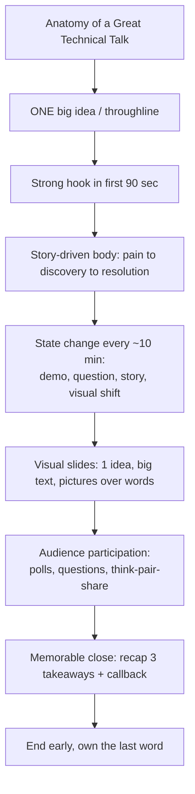

# Keeping People Engaged, Helping Them Remember, and Making Them Enjoy a Technical Presentation

*Research report · Query type: Conceptual / How-to · Synthesized from 7 focused research investigations across public-speaking authorities and cognitive-science literature.*

---

## Executive Summary

Three goals — **engagement** (holding attention), **retention** (making it stick), and **enjoyment** (a good time) — are not separate problems. They share one root cause: the human brain pays attention to, remembers, and enjoys *emotion, story, novelty, and participation*, and tunes out *passive, monotonous information transfer*. The evidence converges from two independent directions: practitioner wisdom from elite speaking coaches (Garr Reynolds, Nancy Duarte, Chris Anderson/TED, Zach Holman, Gary Bernhardt, Scott Berkun) and peer-reviewed cognitive/learning science (Medina, Mayer, Sweller, Paivio, the Heath brothers, and the landmark Freeman 2014 meta-analysis). The single most repeated finding: **a talk is an entertainment and transformation experience first, and an information-transfer exercise second** — if you only need to transfer facts, write a blog post.[^1] The practical playbook below is organized as: (1) the core mindset, (2) engagement tactics, (3) retention tactics, (4) enjoyment tactics, (5) structure, (6) slides & code, and (7) live demos & interaction — followed by a one-page checklist.

---

## The One Big Idea Behind Everything

> *"Dry, academic knowledge transfer can be more easily done with blog posts... What you have instead is the opportunity to take part in the oral storytelling tradition... Good talks aren't supposed to make you feel good — they're supposed to make you **feel**."* — Zach Holman, speaking.io[^1]

Every technique in this report is a specific application of four brain facts:

1. **Attention drifts after ~10 minutes** of passive listening (Medina, *Brain Rules* #4).[^2]
2. **Working memory is tiny** (~4–7 chunks; Miller/Sweller) — overload it and nothing lands.[^3]
3. **We remember emotion, pictures, stories, and surprise** far better than abstract facts (Paivio, Heath brothers, Von Restorff).[^4][^5]
4. **Active retrieval beats passive listening** for both learning and engagement (Freeman 2014; Roediger).[^6][^7]

---

## 1. The Core Mindset (sets up everything else)

| Principle | What it means | Source |
|---|---|---|
| **The audience is the star, not your slides** | You and your connection to the room are the show; slides are support. | Reynolds[^8] |
| **The audience is the hero, you are the mentor** | Frame the talk around *their* transformation (Luke Skywalker), not your expertise (Yoda). | Duarte, *Resonate*[^9] |
| **Talk about experiences, not things** | Narrate *your* struggle, false starts, and resolution — you'll automatically be more passionate and relatable. | Holman[^10] |
| **Be genuinely, visibly excited** | Enthusiasm is contagious via mirror neurons; the #1 differentiator between mediocre and world-class speakers. | Holman[^1], Reynolds[^11] |
| **Ground the talk in reality** | Talk about something that really happened (an outage, a bug), not something you plan to do — more credible and natural. | Holman[^12] |

---

## 2. Keeping People ENGAGED (holding attention)

### 2.1 Design a "state change" every ~10 minutes
Audience attention measurably degrades after 9–10 minutes of passive listening.[^2] Plan a deliberate shift in modality roughly every 8–10 minutes:[^13] switch slides → demo, tell a story after a data section, play a short clip, ask a question, change the slide's visual style/color, or **blank the screen** (press `B` in PowerPoint/Keynote) to put all focus back on you.[^14]

### 2.2 Open with a hook, never "Hello, my name is…"
The first 2–3 minutes are premium attention real estate. Open with a surprising statistic, a 60–90 second vivid story that creates tension, or a provocative question.[^15] Within 90 seconds, explicitly answer *"why should I care?"* in terms of the audience's pain.[^16] (Richard Turere's famous TED talk opened with a lion attack, not his bio.[^15])

### 2.3 Vary your delivery — voice, movement, silence
- **Voice:** speed up to build excitement; slow down to add weight; drop to a *quieter* volume to pull people toward you; never monotone.[^17]
- **Move away from the lectern** — it's a barrier; walk toward the audience, use a clicker.[^18]
- **The power of the pause:** stop for 3–5 seconds before a key transition. *"Nothing makes me look up from my laptop more than the absence of the speaker talking."* Cheat by sipping water.[^19]

### 2.4 Manage energy and low-energy slots (the after-lunch slump)
The 1–3 PM post-lunch dip is physiological, not a reflection of your talk. Counter it: acknowledge the room ("I know we just ate…"), move the audience's bodies ("turn to your neighbor and…"), **keep the lights on** (darkness + warm room = sleep), front-load maximum energy in your opening, and if you can choose, **volunteer to go first or last**.[^20]

### 2.5 End early
Finish in 80–90% of your slot. *"Better to have the audience wanting more."* Going over time is the fastest way to destroy goodwill. Gary Bernhardt: across many thousands of audience members, *"no one has ever complained that time was left over."*[^21]

---

## 3. Helping People REMEMBER (retention)

These are evidence-based cognitive-science principles, each with a direct tech-talk application.

### 3.1 Dual coding — combine words + pictures
The brain encodes a verbal idea and a visual image through two independent channels, giving two retrieval paths.[^4] **Application:** never show text-only slides for architecture/flow — draw it; pair every abstract concept with a visual metaphor; speak *to* the visual instead of reading bullets.

### 3.2 The Picture Superiority Effect
In recognition tests 72 hours later, people recall ~90% of pictures vs ~10% of words; Shepard (1967) found ~98% recognition of 600+ images after one viewing.[^22] **Application:** replace text descriptions with labeled diagrams, real screenshots, and before/after visuals.

### 3.3 Cognitive Load Theory — don't overload working memory
Working memory holds only ~4–7 chunks (Miller 1956; Sweller).[^3] Reduce *extraneous* load: one idea per slide, chunk related concepts into named groups ("The Three Layers…"), give a simplified overview before drilling down, and strip decorative clutter.

### 3.4 Mayer's multimedia principles (the highlights)
From Richard Mayer's 12 evidence-based principles:[^23]
- **Don't narrate slides verbatim** (Redundancy Principle) — identical on-screen text + speech splits attention and *hurts* retention.
- **Signaling:** use arrows, color, and verbal cues ("the key point is…").
- **Spatial contiguity:** put labels *on* the diagram, not in a separate legend.
- **Pre-training:** define key terms *before* the complex explanation.
- **Segmenting:** break content into 5–10 minute learner-paced chunks.

### 3.5 The Rule of Three
Three is the cognitive sweet spot for memorable lists — enough to form a pattern, not enough to overload.[^24] **Application:** state exactly 3 key takeaways up front and again at the end; consolidate 6–8 bullets into 3 categories.

### 3.6 Spacing + repetition ("Tell them three times")
Distributed repetition beats single exposure (Ebbinghaus; Cepeda 2006 meta-analysis: spacing won in 259 of 271 cases).[^25] **Application:** the classic "tell them what you'll tell them / tell them / tell them what you told them" structure;[^26] use **callbacks** ("remember the analogy from the start?"); build a cumulative recap slide.

### 3.7 Primacy & recency — front-load and end strong
Audiences remember the beginning and end far more than the middle (serial position effect).[^27] **Application:** put your most important insight in the first 90 seconds *and* the last 2 minutes; bury the driest technical detail in the middle; **never end on Q&A** (it dilutes the recency slot).

### 3.8 Emotion & surprise are memory amplifiers
Emotionally arousing and *unexpected* content is encoded more deeply (amygdala + Von Restorff "isolation effect").[^5] Stories are widely cited as ~22× more memorable than facts alone (Jennifer Aaker, Stanford).[^28] **Application:** open with a story not an agenda; place one dramatically different slide mid-talk; create a **curiosity gap** ("here's a counterintuitive claim — I'll show you why in 20 minutes").

### 3.9 Concrete analogies and metaphors
Abstract concepts stick when mapped to familiar physical experiences (Craik & Lockhart's levels-of-processing; Hofstadter: "analogy is the core of cognition").[^29] **Application:** OAuth tokens ≈ scoped, time-limited hotel key cards; message queues ≈ post-office sorting rooms; ground stats in human scale ("400ms is long enough for a user to wonder if the app crashed").

### 3.10 The SUCCESs framework (Made to Stick)
Six qualities of "sticky" ideas: **S**imple, **U**nexpected, **C**oncrete, **C**redible, **E**motional, **S**tories.[^30] Beware the **Curse of Knowledge** — experts forget what it's like not to know, and communicate too abstractly.

### 3.11 Retrieval practice (the testing effect)
Pulling information *out* of memory strengthens it far more than re-hearing it.[^7] **Application:** "Before I show the solution — what were the two problems I described?"; ask a *prediction* question before revealing data ("how many think the rewrite made it *slower*?"); end sections with a 30-second "what did we just learn?" micro-recap.

---

## 4. Making It ENJOYABLE (a good time)

### 4.1 Humor — what works in tech talks
HBR research (Wharton/MIT/LBS) shows laughter relieves stress and boredom and boosts engagement.[^31] Safe, high-leverage humor types:
- **Self-deprecation** (safest): laugh at your own past over-engineering or the week you spent debugging a semicolon. Disarms the "expert on a pedestal" dynamic. Don't overdo it.[^32]
- **Relatable developer humor:** merge conflicts at 3am, "it works on my machine," 200 browser tabs — recognition *is* the joke; no punchline needed.[^10]
- **Absurdist slide/meme humor**, **callback humor** (a running joke that returns in the close), and the **rule-of-three twist** ("refactor, write a test, or cry").[^33]

**Never:** punch *down* (at beginners, non-native speakers, anyone with less power), use humor to dodge a hard message, force canned jokes unrelated to your content, or mock products audience members may work on.[^34]

### 4.2 Stage presence & body language (the data is decisive)
Van Edwards' study of 760 viewers found TED talks rated the same on mute as with sound — **nonverbals carry as much weight as words**.[^35] Top-rated speakers used ~465 hand gestures in 18 min vs ~272 for the lowest.[^35] Use *congruent* gestures (say "massive," spread your arms). Keep an open posture, smile (even on serious topics), and remember the **7-second first impression** starts the moment you enter the room.[^36] Use the **stage as a map** — anchor different story moments to different spots.[^37]

### 4.3 Build rapport and connection
- **Vulnerability:** share a real mistake and how you *felt* — it creates psychological safety and gives the audience permission to relate (Brené Brown's most-watched-talk formula).[^38]
- **Pre-talk mingling:** arrive early, chat with a few audience members, then reference them in your talk ("I was talking to Maria back there…") for instant warmth.[^39]
- **Eye contact:** land on individuals for 2–3 seconds rather than scanning — your energy rises and you seem more natural.[^40]

### 4.4 Manage nerves so you appear relaxed
Reframe: *"Nerves are a feeling designed to help you. If you weren't nervous, you don't care."*[^41] Reduce the unknowns — rehearse out loud with a projector and real people, scope the room, do a technical pre-flight (phone on airplane mode, screen brightness up, presenter display set).[^42] If you fumble, stay humble and move on; honesty ("crap, lost my train of thought — let's circle back") earns more respect than a flustered cover-up.[^43]

### 4.5 Surprise, delight, and "wow" moments
A working live demo that does something unexpected is the highest-impact wow moment in a tech talk.[^44] Use color rhythm (offset the intro/closing color scheme so the ending *feels* different),[^45] the black-screen reveal for suspense,[^14] and a **callback close** that returns to the opening image/phrase for aesthetic satisfaction.[^46]

---

## 5. STRUCTURE — frameworks that carry all three goals

| Framework | Core idea | Best for |
|---|---|---|
| **Throughline** (Anderson/TED)[^47] | Build ONE transferable idea; cut everything that doesn't serve it. State it in one sentence before making slides. | Every talk — the foundation |
| **The Sparkline** (Duarte)[^9] | Oscillate between "what is" (pain) and "what could be" (vision); end on vivid "new bliss." | Persuasive / vision talks |
| **Tell-Tell-Tell** (Aristotle/Carnegie)[^26] | Preview 3 points → deliver → recap. Exploits primacy/recency. | Informational / tutorial talks |
| **Problem-first / Why-before-How**[^48] | Motivate with the problem before the solution; *why* before *how*. | Technical / architecture talks |
| **SUCCESs** (Heath brothers)[^30] | Simple, Unexpected, Concrete, Credible, Emotional, Stories. | Idea diagnostic checklist |
| **Pyramid Principle / signposting** (Minto)[^49] | Lead with the conclusion; use explicit verbal signposts between sections to cut working-memory load. | Dense technical content |

**Practical limit:** if each point needs ~4–5 minutes to land, a 20-minute talk should have **no more than 3 main points**.[^50] Story element checklist (TED): a relatable **character**, **tension**, the **right level of detail**, and a **satisfying resolution**.[^51]

---

## 6. SLIDES & CODE (visual enjoyment + retention)

### 6.1 Slide design fundamentals
- **No "slideuments"** — slides are not documents. If detail is needed, hand out a separate PDF.[^8]
- **Design for the back of the room.** Most text is *way* too small. Holman runs ~90–150pt, "design for people three rooms away."[^52]
- **Maximize signal-to-noise** (Tufte): kill logos, footers, gridlines, decorative borders.[^53]
- **Glance media** (Duarte): a slide's core message should be parseable in **~3 seconds**.[^54]
- **One idea per slide**; pictures over words; high contrast; a solid font — *"doing those four things right puts you in the top 10% of speakers."*[^55]

### 6.2 The Assertion-Evidence structure (Michael Alley)
Replace topic-phrase headlines + bullets with a **full-sentence claim headline + a supporting visual**.[^56] Instead of `"System Architecture"`, use `"Microservices reduce deployment risk by isolating failure domains"` over a diagram. Audiences rate these slides clearer and more memorable in Alley's peer-reviewed studies.[^56]

### 6.3 Presenting code
- **Font:** Bernhardt's rule — a capital "X" should be ≥ 0.03× the slide height (roughly 24–30pt minimum at 1080p); leave a ~5% safety margin for projector overscan.[^57]
- **Progressive reveal:** build code up one piece per slide (duplicate the final slide and delete backward) so you narrate each step and the audience never reads line 9 while you discuss line 2.[^58]
- **Syntax highlighting trick:** paste code through GitHub's rendered view and back out to get colored, monospaced text.[^59]
- **Show only the lines that matter** — 5–10 lines max, use `…` for omissions, highlight the active lines.[^60]

### 6.4 Animations
Use animation only to *reveal* information in sequence; skip decorative slide transitions — *"you're going to look like a total moron if you jam over-the-top animations in there."*[^61]

---

## 7. LIVE DEMOS & AUDIENCE INTERACTION

### 7.1 Live demos — de-risk ruthlessly
> *"Live demos are like Global Thermonuclear War: the only way to win is to not do a live demo in front of hundreds of strangers."* — Holman[^62]

When you do demo, de-risk it:
- **Pre-record a screencast** and embed it in the deck — all the visual impact, zero network/typo risk, and you focus on commentary.[^63]
- **Script-based demo:** copy-paste commands from a text file so you never typo live — the audience doesn't care if you type or paste.[^64]
- A working demo that does something *unexpected* is the single highest-impact moment available.[^44]

### 7.2 Audience participation — backed by hard evidence
The Freeman et al. 2014 PNAS meta-analysis of **225 studies** found active learning raised scores by **+0.47 SD** and made traditional-lecture students **1.55× more likely to fail**.[^6] Peer discussion improves answers *even when no one in the group originally knew the answer* (Smith 2009, *Science*).[^65] Techniques:
- **Live polling** (Mentimeter, Slido, Kahoot): opening diagnostic ("how familiar are you with X?"), concept checks, word-cloud pain-point gathering, and Q&A-with-upvoting so the best questions surface.[^66] *Caution:* Kahoot's game-show format can feel infantilizing for senior audiences — great for workshops/bootcamps, risky for serious assessment.[^67]
- **Think-pair-share** and "turn to your neighbor" prompts double as engagement *and* a physical state change.
- **Show-of-hands and rhetorical questions** at transitions; let rhetorical ones hang 2–3 seconds.[^68]
- **Q&A management:** take questions but follow with a brief closing so you own the last word; use upvoting tools to avoid dominant voices.[^69]

---

## One-Page Checklist

**Before you build slides**
- [ ] Write your **throughline** in one sentence.
- [ ] Pick the **3** takeaways. Choose a structure (Sparkline / Tell-Tell-Tell / Problem-first).
- [ ] Find a real **story** (pain → discovery → resolution) and a **hook** for the first 90 seconds.

**Designing slides**
- [ ] One idea per slide; huge text; pictures over words; high contrast; no slideuments.
- [ ] Assertion headlines (full sentences) + a supporting visual.
- [ ] Code: big font, progressive reveal, only the lines that matter.
- [ ] Plan a **state change** every ~10 minutes; insert intentional black slides.

**Delivery**
- [ ] Open with the hook; signal "what's in it for them" within 90 seconds.
- [ ] Vary pace/pitch/volume; use pauses; move away from the lectern; make real eye contact.
- [ ] Be visibly excited; use self-deprecating/relatable humor; show one moment of vulnerability.
- [ ] Add ≥1 participation moment (poll, think-pair-share, prediction question).
- [ ] De-risk any demo (screencast backup or scripted commands).
- [ ] Recap the 3 takeaways; use a callback close; **end early**; don't end on Q&A.

---

## Confidence Assessment

**High confidence (multiple independent, authoritative sources agree):**
- Story > facts; one big idea/throughline; enthusiasm is the top delivery differentiator; design state changes ~every 10 min; one idea per slide / big text / pictures over words; end early; never end on Q&A; de-risk live demos. These are echoed by *every* practitioner source and align with cognitive science.
- The active-learning advantage is exceptionally well-evidenced (Freeman 2014 meta-analysis of 225 studies, +0.47 SD; the authors note medical trials with such effects "may have been stopped for benefit").[^6]

**Solid confidence (well-established science, applied by analogy to talks):**
- Dual coding, picture superiority, cognitive load, primacy/recency, spacing, testing effect, Von Restorff. These are robust lab findings; their *application* to live talks is widely recommended but less often measured in the talk setting specifically.

**Lower confidence / caveats (noted by the researchers):**
- The "10-minute attention" rule is widely cited but rests primarily on Medina's *Brain Rules* synthesis rather than a single definitive primary study.
- "Stories are 22× more memorable" traces to a Jennifer Aaker teaching exercise, not a published controlled study — directionally sound, exact multiplier unverified.
- The post-lunch slump is well-established circadian biology but was not tied to a presentation-specific peer-reviewed study in this research.
- Scott Hanselman's classic conference-talk tips post appears to have been removed in a site migration (may be on the Wayback Machine); his advice is well-attested in secondary sources.

**Assumptions made:** The query was treated as a general (non-codebase) public-speaking question about software/developer-audience technical talks. Sources were weighted toward developer-conference practitioners (Holman, Bernhardt) plus general speaking authorities and learning science.

---

## Key Sources at a Glance

| Source | Author | Type |
|---|---|---|
| speaking.io | Zach Holman (GitHub) | Dev-conference speaker guide |
| Presentation Zen (delivery/design/prep tips) | Garr Reynolds | Speaker coach / book |
| Brain Rules (Rule #4: Attention) | John Medina | Neuroscience book |
| Resonate / Slide:ology | Nancy Duarte | Presentation books |
| TED Talks: The Official Guide | Chris Anderson | Public-speaking book |
| Made to Stick | Chip & Dan Heath | Cognitive/communication book |
| Make It Stick | Brown/Roediger/McDaniel | Learning-science book |
| Multimedia Learning | Richard Mayer | Cognitive-science book |
| How to Prepare a Talk | Gary Bernhardt (Deconstruct) | Dev-conference guide |
| The Craft of Scientific Presentations | Michael Alley | Assertion-evidence research |
| Active learning increases student performance | Freeman et al. 2014, PNAS | Peer-reviewed meta-analysis |

---

## Footnotes

[^1]: Zach Holman, "Talks Are Entertainment," https://speaking.io/plan/talks-are-entertainment/
[^2]: John Medina, *Brain Rules*, Rule #4 (Attention), https://www.brainrules.net/attention
[^3]: George A. Miller (1956), "The Magical Number Seven, Plus or Minus Two," *Psychological Review* 63(2):81–97; John Sweller (1988), *Cognitive Science* 12:257–285. https://en.wikipedia.org/wiki/Cognitive_load_theory
[^4]: Allan Paivio (1971/1986), Dual-coding theory. https://en.wikipedia.org/wiki/Dual-coding_theory
[^5]: Hedwig von Restorff (1933), isolation effect; Mather & Sutherland (2011), arousal-biased competition, *Perspectives on Psychological Science* 6(2):114–133. https://en.wikipedia.org/wiki/Von_Restorff_effect
[^6]: Freeman et al. (2014), "Active learning increases student performance in science, engineering, and mathematics," *PNAS* 111(23):8410–8415. https://www.ncbi.nlm.nih.gov/pmc/articles/PMC4060654/
[^7]: Brown, Roediger & McDaniel (2014), *Make It Stick*, Harvard University Press; Roediger & Karpicke (2006), *Psychological Science* 17(3):249–255. https://en.wikipedia.org/wiki/Testing_effect
[^8]: Garr Reynolds, "Design Tips" (slides vs. slideuments; the speaker is the star), https://www.garrreynolds.com/design-tips/
[^9]: Nancy Duarte, *Resonate* (Wiley, 2010); "Structure Your Presentation Like a Story," *HBR* Oct 2012. https://hbr.org/2012/10/structure-your-presentation-li/
[^10]: Zach Holman, "Talks Are Entertainment" (talk about experiences, not things), https://speaking.io/plan/talks-are-entertainment/
[^11]: Garr Reynolds, "Delivery Tips" (your feelings are contagious), https://www.garrreynolds.com/delivery-tips/
[^12]: Zach Holman, "What They Don't Tell You About Public Speaking" (reactionary not anticipatory), https://speaking.io/deliver/what-they-dont-tell-you-about-public-speaking/
[^13]: Garr Reynolds, "Preparation Tips" (designing changes per the 10-minute rule), https://www.garrreynolds.com/preparation-tips/
[^14]: Garr Reynolds, "Delivery Tips" (the "B" key blanks the screen), https://www.garrreynolds.com/delivery-tips/
[^15]: Garr Reynolds, "Delivery Tips" (open with story/stat); Carmine Gallo, HBR, "How to Give a Killer Presentation" (Richard Turere). https://hbr.org/2013/06/how-to-give-a-killer-presentation
[^16]: Garr Reynolds, "Preparation Tips" (what's in it for them), https://www.garrreynolds.com/preparation-tips/
[^17]: Zach Holman, "Your Voice" (pace/pitch/volume), https://speaking.io/deliver/your-voice/
[^18]: Garr Reynolds, "Delivery Tips" (move away from the lectern), https://www.garrreynolds.com/delivery-tips/
[^19]: Zach Holman, "Your Voice" (the power of the pause), https://speaking.io/deliver/your-voice/
[^20]: Garr Reynolds, "Delivery Tips" and "Preparation Tips" (lights on; volunteer first/last), https://www.garrreynolds.com/delivery-tips/
[^21]: Garr Reynolds, "Delivery Tips" (finish early); Gary Bernhardt, "How to Prepare a Talk," https://www.deconstructconf.com/blog/how-to-prepare-a-talk
[^22]: R.N. Shepard (1967), *Journal of Verbal Learning and Verbal Behavior* 6:156–163. https://en.wikipedia.org/wiki/Picture_superiority_effect
[^23]: Richard E. Mayer (2021), *Multimedia Learning*, 3rd ed., Cambridge University Press. https://en.wikipedia.org/wiki/Richard_E._Mayer
[^24]: "Rule of three (writing)," https://en.wikipedia.org/wiki/Rule_of_three_(writing)
[^25]: Hermann Ebbinghaus (1885), *Über das Gedächtnis*; Cepeda et al. (2006), *Psychological Bulletin* 132(3):354–380. https://en.wikipedia.org/wiki/Spacing_effect
[^26]: Classical three-part structure (Aristotle, *Rhetoric*; popularized by Dale Carnegie). https://www.speakingaboutpresenting.com/content/presentation-structure/
[^27]: Murdock (1962), *Journal of Experimental Psychology* 64(5):482–488. https://en.wikipedia.org/wiki/Serial-position_effect
[^28]: Jennifer Aaker (Stanford), stories ~22× more memorable than facts (teaching exercise, widely cited).
[^29]: Craik & Lockhart (1972), levels of processing, *Journal of Verbal Learning and Verbal Behavior* 11(6):671–684; Hofstadter & Sander (2013), *Surfaces and Essences*. https://en.wikipedia.org/wiki/Levels_of_processing_effect
[^30]: Chip & Dan Heath (2007), *Made to Stick*, Random House. https://heathbrothers.com/books/made-to-stick/
[^31]: Alison Beard, "Leading with Humor," *HBR* May 2014. https://hbr.org/2014/05/leading-with-humor
[^32]: Zach Holman, "Fucking Up" / self-deprecation in openings, https://speaking.io/deliver/fucking-up/
[^33]: Rule-of-three comic twist and callback humor (synthesis across Holman speaking.io and rhetoric sources).
[^34]: Humor pitfalls — never punch down (synthesis across HBR "Leading with Humor" and speaking.io).
[^35]: Vanessa Van Edwards TED body-language study (760 viewers; gesture counts), *Toastmasters Magazine* Sept 2020. https://www.toastmasters.org/magazine/magazine-issues/2020/sept/the-power-of-body-language
[^36]: Van Edwards on the 7-second first impression and smiling, *Toastmasters Magazine* Sept 2020 (same URL as [^35]).
[^37]: Craig Valentine / Bill Brown, "Use the Stage as a Visual Aid," *Toastmasters Magazine* Aug 2019. https://www.toastmasters.org/magazine/magazine-issues/2019/aug/use-the-stage-as-visual-aid
[^38]: Brené Brown, "The Power of Vulnerability," TEDxHouston. https://www.ted.com/talks/brene_brown_the_power_of_vulnerability
[^39]: Garr Reynolds, "Delivery Tips" (mingle before the talk), https://www.garrreynolds.com/delivery-tips/
[^40]: Garr Reynolds, "Delivery Tips" (eye contact with individuals), https://www.garrreynolds.com/delivery-tips/
[^41]: Zach Holman, "Nervousness," https://speaking.io/deliver/nervousness/
[^42]: Garr Reynolds, "Delivery Tips" (we fear what we don't know); Zach Holman, scoping the room & pre-flight, https://speaking.io/deliver/what-they-dont-tell-you-about-public-speaking/
[^43]: Zach Holman, "What They Don't Tell You About Public Speaking" (recovering from gaffes), https://speaking.io/deliver/what-they-dont-tell-you-about-public-speaking/
[^44]: Zach Holman, "Live Demos" (the unexpected working demo as wow moment), https://speaking.io/prep/live-demos/
[^45]: Zach Holman, "Color" (offset intro/closing colors), https://speaking.io/design/color/
[^46]: Garr Reynolds, "Preparation Tips" (do not end on Q&A; callback close), https://www.garrreynolds.com/preparation-tips/
[^47]: Chris Anderson, *TED Talks: The Official TED Guide to Public Speaking* (2016); "TED's Secret to Great Public Speaking" (TED Talk). https://www.ted.com/talks/chris_anderson_ted_s_secret_to_great_public_speaking
[^48]: Problem-first / why-before-how structure (synthesis; cf. Simon Sinek "Start With Why" and Duarte/Anderson).
[^49]: Barbara Minto, *The Pyramid Principle*; signposting guidance from Olivia Mitchell. https://www.speakingaboutpresenting.com/content/presentation-structure/
[^50]: Olivia Mitchell (speakingaboutpresenting.com): ≤3 main points for a 20-minute talk. https://www.speakingaboutpresenting.com/content/presentation-structure/
[^51]: Chris Anderson (TED), four story elements (character, tension, detail, resolution). https://ideas.ted.com/storytelling/
[^52]: Zach Holman, "Slide Design for Developers" / Typography (design for the back of the room). https://zachholman.com/posts/slide-design-for-developers/
[^53]: Garr Reynolds, "Design Tips" (signal-to-noise ratio, citing Tufte and *Universal Principles of Design*), https://www.garrreynolds.com/design-tips/
[^54]: Nancy Duarte, *Slide:ology* (glance media / 3-second rule), cited by Reynolds, https://www.garrreynolds.com/design-tips/
[^55]: Zach Holman, "Typography" (big text, contrast, few words, solid font), https://speaking.io/design/typography/
[^56]: Michael Alley, *The Craft of Scientific Presentations*; assertion-evidence design. https://www.assertion-evidence.com/
[^57]: Gary Bernhardt, "How to Prepare a Talk" (X-height font rule, safety margin), https://www.deconstructconf.com/blog/how-to-prepare-a-talk
[^58]: Gary Bernhardt, same source (progressive reveal / building code backward). https://www.deconstructconf.com/blog/how-to-prepare-a-talk
[^59]: Gary Bernhardt, same source (color code via GitHub paste). https://www.deconstructconf.com/blog/how-to-prepare-a-talk
[^60]: Synthesis across Bernhardt and Holman: show only the lines that matter, highlight active lines.
[^61]: Zach Holman, "Transitions" (skip over-the-top animations); Nielsen Norman Group on purposeful animation. https://speaking.io/design/transitions/
[^62]: Zach Holman, "Live Demos," https://speaking.io/prep/live-demos/
[^63]: Zach Holman, "Live Demos" (pre-recorded screencast), https://speaking.io/prep/live-demos/
[^64]: Zach Holman, "Live Demos" (script-based copy-paste demo), https://speaking.io/prep/live-demos/
[^65]: Smith et al. (2009), "Why Peer Discussion Improves Student Performance on In-Class Concept Questions," *Science* 323(5910):122–124. doi:10.1126/science.1165919
[^66]: Audience response systems and tools (Mentimeter, Slido, Kahoot). https://en.wikipedia.org/wiki/Audience_response_system ; https://en.wikipedia.org/wiki/Mentimeter
[^67]: Kahoot game-format caveat; Wang & Tahir (2020), *Computers & Education*. https://en.wikipedia.org/wiki/Kahoot!
[^68]: Garr Reynolds, "Preparation Tips" (ask questions / short quizzes), https://www.garrreynolds.com/preparation-tips/
[^69]: Garr Reynolds, "Preparation Tips" (don't end on Q&A); Slido upvoting for Q&A. https://www.garrreynolds.com/preparation-tips/
