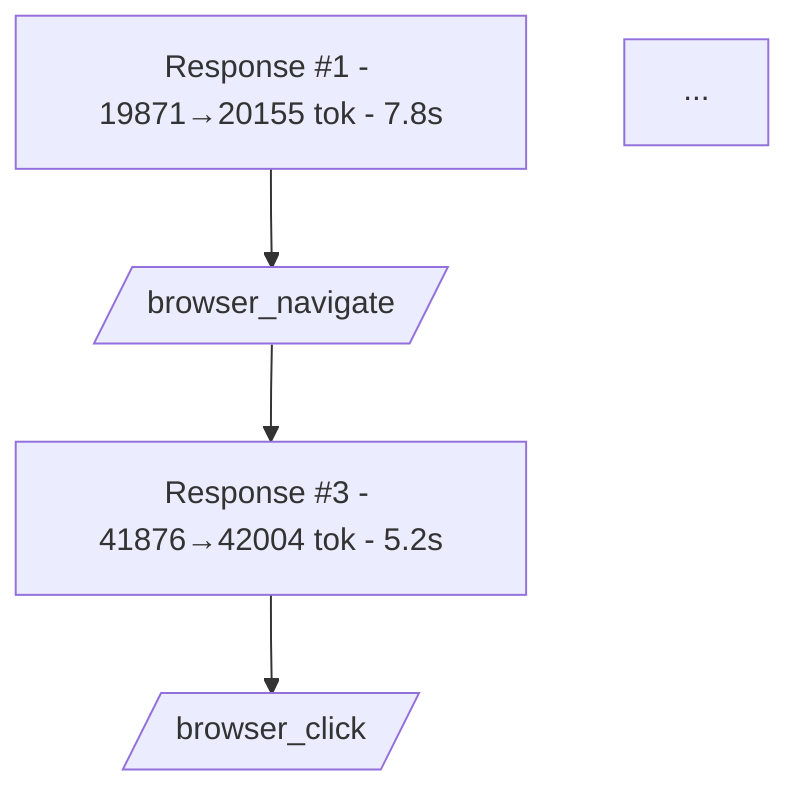
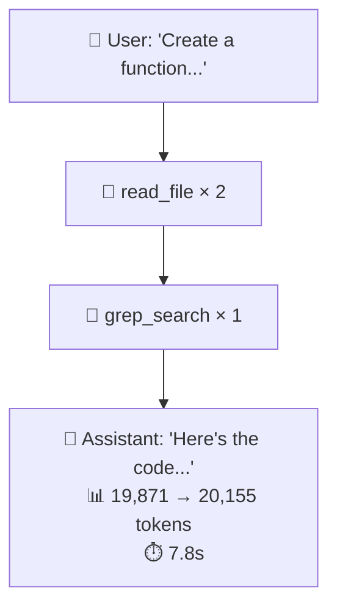

# Copilot Conversation Visualizer - Extension Idea

**Generated:** January 31, 2026  
**Context:** Exploring a VS Code extension to visualize GitHub Copilot chat conversations using the debug chat log  
**Status:** 📋 Planning Complete - Ready for Implementation

---

## Project Files

| File                                                                                         | Description                                           |
| -------------------------------------------------------------------------------------------- | ----------------------------------------------------- |
| [copilot-conversation-visualizer-extension.md](copilot-conversation-visualizer-extension.md) | This planning document                                |
| [types/chatreplay.ts](types/chatreplay.ts)                                                   | TypeScript interfaces for parsing the JSON log format |
| [types/mermaid-generator.ts](types/mermaid-generator.ts)                                     | Mermaid diagram generator prototype                   |

---

## Overview

An extension that parses GitHub Copilot's debug chat log and creates an interactive visualization of conversations, showing the full context of what was sent to and received from the LLM, including tool calls, system prompts, and token usage.

---

## Existing Solutions Research

### What Already Exists

| Extension                      | Installs | Purpose                                                          | Gap                                                          |
| ------------------------------ | -------- | ---------------------------------------------------------------- | ------------------------------------------------------------ |
| **GitHub Copilot Chat Logger** | 365      | Logs chat interactions to JSON in a circular buffer              | **No visualization** - just logging. Could be complementary. |
| **Copilot Logger**             | 1K       | Tracks Copilot completions and chat sessions, aggregates metrics | **No visualization** - data collection only                  |
| **Copilot to MD**              | 2        | Logs Copilot chat to markdown                                    | **Very basic** - just text export                            |

### Key Finding

**Nothing exists that visualizes the full conversation structure, tool calls, context usage, or token consumption.** The closest is logging extensions, but they don't provide the interactive graph visualization or the ability to drill into system prompts and tool calls.

---

## Data Sources

### VS Code Copilot Debug Log

- **Location:** Output panel → "GitHub Copilot" or "GitHub Copilot Chat" dropdown
- **Debug Mode:** `Developer: Set Log Level` → Select GitHub Copilot Chat → Set to "Trace"
- **Contents when in Trace mode:**
    - System prompts
    - User messages
    - Assistant responses
    - Tool calls (including arguments and results)
    - Model information
    - Timing information
    - Token counts (possibly, needs verification)

### Challenges

1. The debug log format is not officially documented
2. Log format may change between VS Code/extension versions
3. ~~May need to parse unstructured text or semi-structured JSON~~ **RESOLVED: It's clean JSON!**

---

## JSON Schema (Discovered from Sample Export)

The `.chatreplay.json` export file has a well-structured schema. Here's what we discovered:

### Top-Level Structure

```typescript
interface ChatReplayLog {
    prompt: string; // Original user prompt that started the conversation
    hasSeen: boolean; // Whether the user has viewed this log
    logCount: number; // Total number of log entries
    logs: LogEntry[]; // Array of request and tool call entries
}
```

### Log Entry Types

There are two types of log entries:

```typescript
type LogEntry = RequestLog | ToolCallLog;

interface RequestLog {
    id: string; // Unique identifier (e.g., "a4b08e38")
    kind: "request"; // Discriminator
    type: "ChatMLSuccess"; // Response type
    name: string; // Agent name (e.g., "panel/editAgent")
    metadata: RequestMetadata;
    requestMessages: RequestMessages;
    response: Response;
    thinking?: ThinkingContent;
}

interface ToolCallLog {
    id: string; // Unique tool call ID
    kind: "toolCall"; // Discriminator
    tool: string; // Tool name (e.g., "mcp_microsoft_pla_browser_navigate")
    args: string; // JSON string of tool arguments
    time: string; // Timestamp
    response: any[]; // Tool response array
    thinking?: ThinkingContent;
}
```

### Metadata Structure (Rich Token Data!)

```typescript
interface RequestMetadata {
    requestType: "ChatCompletions";
    model: string; // e.g., "claude-opus-4.5"
    maxPromptTokens: number; // e.g., 127997
    maxResponseTokens: number; // e.g., 16000
    location: number;
    startTime: string; // ISO timestamp
    endTime: string; // ISO timestamp
    duration: number; // milliseconds
    ourRequestId: string;
    requestId: string;
    serverRequestId: string;
    timeToFirstToken: number; // milliseconds
    usage: TokenUsage;
    tools: ToolDefinition[];
}

interface TokenUsage {
    completion_tokens: number;
    prompt_tokens: number;
    prompt_tokens_details: {
        cached_tokens: number; // Great for understanding caching!
    };
    total_tokens: number;
}
```

### Example Token Progression

From analyzing a real conversation:
| Time | Prompt | Completion | Cached | Total | Duration |
|------|--------|------------|--------|-------|----------|
| 23:40:36 | 19,871 | 284 | 0 | 20,155 | 7.8s |
| 23:40:48 | 41,876 | 128 | 18,067 | 42,004 | 5.2s |
| 23:40:56 | 48,619 | 143 | 41,861 | 48,762 | 4.5s |
| ... | ... | ... | ... | ... | ... |
| 23:41:39 | 83,400 | 2,535 | 82,166 | 85,935 | 51.0s |

**Key Finding:** Token usage IS available and quite detailed, including cache hit rates!

### Thinking Content

```typescript
interface ThinkingContent {
    id?: string;
    text?: string; // The model's reasoning/thinking text
}
```

### Messages Structure

```typescript
interface RequestMessages {
    messages: Message[];
}

interface Message {
    role: 0 | 1; // 0 = system/user, 1 = assistant
    content: ContentItem[];
}

interface ContentItem {
    type: number; // 1 = text, 3 = ?
    text?: string;
    cacheType?: string;
}
```

---

## Feature Analysis

### Must-Have Features (MVP)

| Feature                                      | Feasibility | Notes                                                            |
| -------------------------------------------- | ----------- | ---------------------------------------------------------------- |
| **Parse debug log into structured data**     | ✅ High     | Clean JSON format - just parse and validate                      |
| **Graph visualization of conversation flow** | High        | User → Assistant alternation is linear; tools add branches       |
| **Click-to-expand node details**             | High        | Standard webview interaction                                     |
| **Show tool calls per node**                 | ✅ High     | ToolCallLog entries have clear structure with tool name and args |
| **Show instruction files used**              | Medium      | May be in requestMessages content - needs extraction             |
| **Show files in context**                    | Medium      | May be in requestMessages content - needs extraction             |

### Nice-to-Have Features

| Feature                     | Feasibility | Notes                                                                    |
| --------------------------- | ----------- | ------------------------------------------------------------------------ |
| **Token/context % used**    | ✅ High     | Available in metadata.usage - prompt_tokens, cached_tokens, total_tokens |
| **Premium requests count**  | Low         | Not visible in logs - would need separate API                            |
| **Export to Mermaid/image** | High        | Straightforward once graph is built                                      |
| **Compare conversations**   | Medium      | Nice for A/B testing prompts                                             |
| **Filter by time range**    | High        | startTime/endTime available in metadata                                  |
| **Show thinking/reasoning** | ✅ High     | Available in thinking.text field                                         |
| **Show cache efficiency**   | ✅ High     | cached_tokens available - can calculate %                                |
| **Time to first token**     | ✅ High     | timeToFirstToken available in ms                                         |

### Future Feature Ideas (Brainstorm)

#### Analytics & Insights

| Feature                     | Description                                                                                |
| --------------------------- | ------------------------------------------------------------------------------------------ |
| **Context window gauge**    | Visual meter showing how full the 128K window is                                           |
| **Cost estimation**         | Approximate $ value based on token usage (educational even though Copilot is subscription) |
| **Tool usage heatmap**      | Which tools are called most? Which are slowest?                                            |
| **Cache efficiency trends** | How well is caching working over time?                                                     |
| **Bottleneck detection**    | Highlight the slowest tool calls or requests                                               |

#### Productivity & Learning

| Feature                  | Description                                                              |
| ------------------------ | ------------------------------------------------------------------------ |
| **Conversation diff**    | Compare two conversations to see how different prompts affected outcomes |
| **Prompt copy button**   | One-click copy of the exact prompt sent (for experimentation)            |
| **Annotations**          | Add personal notes to specific nodes for learning                        |
| **Bookmarks**            | Mark important moments in a conversation                                 |
| **System prompt viewer** | See the full system prompt that was sent                                 |

#### Visualization Enhancements

| Feature                   | Description                                                      |
| ------------------------- | ---------------------------------------------------------------- |
| **Animated replay**       | Watch the conversation unfold in real-time playback              |
| **Agentic loop view**     | For multi-step tool use, show think→act→observe cycles clearly   |
| **Collapsed mode**        | Ultra-compact view showing just user prompts and final responses |
| **Tool dependency graph** | Which tools tend to be used together?                            |

#### Export & Sharing

| Feature                   | Description                                 |
| ------------------------- | ------------------------------------------- |
| **Export to GitHub Gist** | Quick share (with privacy warning)          |
| **HTML report**           | Standalone file you can open in any browser |
| **Markdown summary**      | Human-readable version for documentation    |

#### Edge Case Handling

| Feature                         | Description                                   |
| ------------------------------- | --------------------------------------------- |
| **Failed request highlighting** | Show when requests errored or timed out       |
| **Model switch detection**      | Alert when the model changed mid-conversation |
| **Instruction file tracking**   | Show which skills/instructions were loaded    |

### Copilot CLI Support

- **Feasibility:** Unknown - needs research
- **Questions:**
    - Does GitHub Copilot CLI produce similar debug logs?
    - Is there an equivalent "trace" mode for the CLI?
    - Where would CLI logs be stored?

---

## Visualization Options

### Mermaid Diagrams

**Pros:**

- Native VS Code preview support
- Export-friendly (can paste into docs/GitHub)
- Good for static snapshots
- Simple to generate

**Cons:**

- Limited interactivity (no click-to-expand)
- Doesn't handle large conversations well
- No real-time updates
- Styling limitations

### Custom Webview (Recommended)

**Pros:**

- Full interactivity (click to expand, hover for tooltips)
- Can handle large conversations with scroll/zoom
- Real-time updates possible
- Rich styling control
- Can include collapsible sections for system prompts

**Cons:**

- More complex to implement
- Need to pick a graph library (D3.js, vis.js, Cytoscape.js, React Flow)

### Hybrid Approach

Use a **custom webview for interactive exploration** but include an **"Export to Mermaid"** button for when users want to save/share a static version of the conversation graph.

### Mermaid Feasibility Assessment ✅

**Tested with real conversation data (23 log entries):**

The linear flow of request → tool → request works well in Mermaid:



**Findings:**

- ✅ Linear flow renders cleanly
- ✅ Token usage can be shown in node labels
- ✅ Tool calls can use different shapes (`[/parallelogram/]`)
- ⚠️ Long conversations create tall diagrams (23 entries = ~50 lines)
- ⚠️ No interactivity - can't click for details
- ⚠️ Node labels can get cluttered with too much info

**Recommendation:** Start with Mermaid for MVP (simpler), add webview later for interactivity. Use a "grouped" view that collapses consecutive tool calls into a single node for cleaner diagrams.

---

## Suggested Architecture

```
┌─────────────────────────────────────────────────────────────┐
│                    VS Code Extension                         │
├─────────────────────────────────────────────────────────────┤
│                                                              │
│  ┌──────────────┐    ┌──────────────┐    ┌───────────────┐  │
│  │ Log Watcher  │───▶│ Log Parser   │───▶│ Conversation  │  │
│  │ (File/Output)│    │ (Text→JSON)  │    │ Model         │  │
│  └──────────────┘    └──────────────┘    └───────┬───────┘  │
│                                                   │          │
│                                                   ▼          │
│  ┌──────────────────────────────────────────────────────┐   │
│  │                    Webview Panel                      │   │
│  │  ┌─────────────────────────────────────────────────┐ │   │
│  │  │              Graph Visualization                 │ │   │
│  │  │  [User] ──▶ [Tools] ──▶ [Assistant]             │ │   │
│  │  │    │                         │                   │ │   │
│  │  │    ▼                         ▼                   │ │   │
│  │  │  [Details Panel - System prompt, tools, etc.]   │ │   │
│  │  └─────────────────────────────────────────────────┘ │   │
│  └──────────────────────────────────────────────────────┘   │
│                                                              │
└─────────────────────────────────────────────────────────────┘
```

---

## Clarifying Questions (ANSWERED ✅)

### 1. Primary Use Case

**What's your main goal for this extension?**

- ✅ **(D) All of the above** - Debugging/learning, optimization, and documentation all matter equally

### 2. Conversation Scope

**What conversations do you want to visualize?**

- ✅ **(A) Only the current/active chat session** - Not interested in historical logs

### 3. Node Granularity

**How detailed should each node be?**

- ✅ **One node per message, with tool calls/context associated somehow** - User unsure of best visualization approach, open to design exploration

### 4. Real-Time vs Snapshot

**When should the graph update?**

- ✅ **(B) On-demand when user triggers a "refresh" command** - Easier approach preferred initially, open to hooks if not harder

### 5. Token/Cost Priority

**How important is token/cost tracking?**

- ✅ **(B) Nice-to-have** - Good news: Token data IS available in the logs!

### 6. CLI Support Priority

**How important is Copilot CLI support?**

- ✅ **(B) Nice to have in v2** - VS Code first, CLI later

### 7. Export Format Priority

**Which export format matters most?**

- ✅ **Mermaid and JSON** - Mermaid is more important IF the UI can reasonably be done with Mermaid

### 8. Distribution

**How do you want to distribute this?**

- ✅ **(B) Open source on GitHub** - Personal use initially, eventually publish to VS Code Marketplace for free

---

## Design Decisions (Based on Answers)

Given the user's answers, here's the recommended approach:

### Visualization Strategy: Hybrid Mermaid + Details Panel

Since Mermaid export is high priority, design the UI around Mermaid's capabilities:

1. **Main View**: Mermaid flowchart rendered in a webview
2. **Details Panel**: Collapsible sidebar or modal for drilling into nodes
3. **Export**: Native Mermaid code export + JSON

**Mermaid Limitations to Work Around:**

- No click-to-expand → Use hover tooltips or separate details panel
- Can't embed collapsible sections → Show summary in node, details on click
- Long text truncation → Node shows abbreviated version

### Node Structure for Mermaid



### Architecture (Simplified for MVP)

```
┌─────────────────────────────────────────────────────────────┐
│                    VS Code Extension                         │
├─────────────────────────────────────────────────────────────┤
│                                                              │
│  ┌──────────────┐    ┌───────────────┐    ┌──────────────┐  │
│  │ Command:     │───▶│ JSON Parser   │───▶│ Mermaid      │  │
│  │ Load Log     │    │ (chatreplay)  │    │ Generator    │  │
│  └──────────────┘    └───────────────┘    └──────┬───────┘  │
│                                                   │          │
│                                                   ▼          │
│  ┌──────────────────────────────────────────────────────┐   │
│  │              Webview Panel (Split View)               │   │
│  │  ┌────────────────────┐  ┌────────────────────────┐  │   │
│  │  │   Mermaid Graph    │  │    Details Panel       │  │   │
│  │  │                    │  │  - System prompt       │  │   │
│  │  │   [U] → [T] → [A]  │  │  - Tool args/response  │  │   │
│  │  │                    │  │  - Token breakdown     │  │   │
│  │  │   [U] → [A]        │  │  - Thinking content    │  │   │
│  │  └────────────────────┘  └────────────────────────┘  │   │
│  │                                                       │   │
│  │  ┌─────────────────────────────────────────────────┐ │   │
│  │  │  Summary Bar: 12 requests | 11 tools | 85K tok  │ │   │
│  │  └─────────────────────────────────────────────────┘ │   │
│  └──────────────────────────────────────────────────────┘   │
│                                                              │
└─────────────────────────────────────────────────────────────┘
```

---

## Technical Research Needed

1. ~~**Debug Log Format Analysis**~~ ✅ DONE
    - ~~Need to capture sample debug logs in Trace mode to understand the exact format~~
    - ~~Document the schema of tool calls, messages, and metadata~~
    - **Result:** Clean JSON with rich metadata including token usage!

2. **Copilot CLI Investigation** (Deferred to v2)
    - Research if `gh copilot` has a debug/verbose mode
    - Check where logs are stored (if any)

3. ~~**Token Counting**~~ ✅ DONE
    - ~~Determine if token counts are in the logs~~
    - ~~If not, investigate client-side tokenizer options (tiktoken for JavaScript)~~
    - **Result:** Full token data available: prompt, completion, cached, total

4. **Premium Request Tracking**
    - Research if there's any API or log entry for premium request consumption
    - May need to rely on GitHub's dashboard instead

---

## Next Steps

### Phase 1: MVP (Target: Working Prototype)

1. ✅ ~~Create detailed technical specification~~ (this document)
2. [ ] Set up extension scaffold with TypeScript + Webpack
3. [ ] Implement JSON parser for `.chatreplay.json` format
4. [ ] Create Mermaid generator from parsed data
5. [ ] Build webview with Mermaid rendering + details panel
6. [ ] Add "Load Chat Log" command
7. [ ] Add "Export to Mermaid" command

### Phase 2: Polish

8. [ ] Add token usage summary bar
9. [ ] Improve node click → details panel interaction
10. [ ] Add cache efficiency visualization
11. [ ] Add thinking/reasoning content display
12. [ ] Handle edge cases (empty logs, malformed JSON)

### Phase 3: v2 Features

13. [ ] Investigate Copilot CLI log format
14. [ ] Add file watching for auto-refresh
15. [ ] Research premium request tracking

---

## VS Code Extension Development Notes

### Scaffolding with `yo code`

The official way to create a VS Code extension is with the Yeoman generator:

```bash
npm install -g yo generator-code
yo code
```

This walks you through setup questions:

- Extension type (New Extension, Color Theme, Language Support, etc.)
- TypeScript or JavaScript
- Extension name and identifier
- Whether to include a bundler (webpack/esbuild)

It generates the boilerplate: `package.json`, `tsconfig.json`, `.vscode/launch.json`, and a basic `extension.ts` entry point.

### Bundling (Webpack/esbuild)

**Do you need it?**

- **For personal use / MVP:** No. Multiple `.js` files work fine.
- **For Marketplace publishing:** Recommended. Bundles everything into a single file for faster load times and smaller package size.

The `yo code` generator offers to set up webpack or esbuild. You can skip it initially and add later when ready to publish.

### Key Files in a VS Code Extension

| File                  | Purpose                                                               |
| --------------------- | --------------------------------------------------------------------- |
| `package.json`        | Extension manifest - commands, activation events, contribution points |
| `src/extension.ts`    | Entry point - `activate()` and `deactivate()` functions               |
| `.vscode/launch.json` | Debug configuration to test extension in Extension Development Host   |
| `tsconfig.json`       | TypeScript configuration                                              |

### Useful Resources

- [VS Code Extension API](https://code.visualstudio.com/api)
- [Your First Extension](https://code.visualstudio.com/api/get-started/your-first-extension)
- [Webview API](https://code.visualstudio.com/api/extension-guides/webview) - for the Mermaid visualization panel
- [Extension Marketplace Publishing](https://code.visualstudio.com/api/working-with-extensions/publishing-extension)

---

## Notes

- This could make an excellent **blog post** or **conference talk** about building dev tools and understanding LLM interactions
- Consider whether this could be generalized to other LLM chat interfaces (Cursor, Claude chat, etc.)
- Privacy consideration: Debug logs may contain sensitive code/prompts - extension should never send data externally
- **Extension name ideas:** "Copilot Lens", "Copilot Debugger", "Chat Replay Visualizer", "Copilot Flow"
