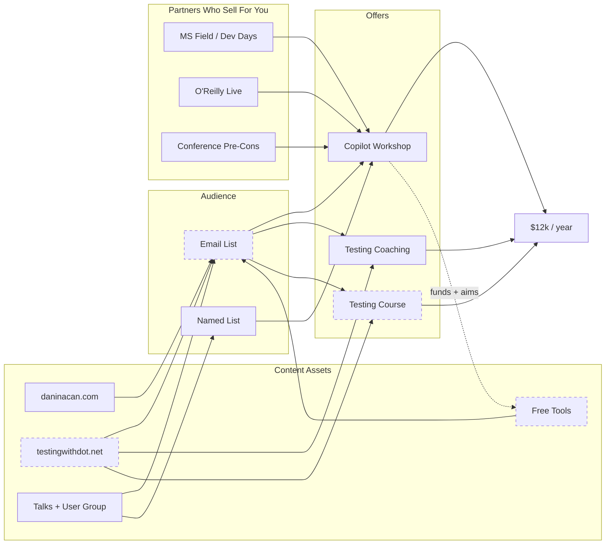
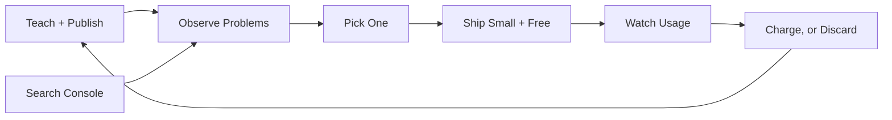

# Side Income: Ecosystem Map

**Generated:** August 31, 2026
**Context:** Visual companion to [workshop-on-ramp-plan.md](workshop-on-ramp-plan.md) and [building-plan.md](building-plan.md). Nodes are deliberately terse - the reasoning lives in those two documents.

---

## The Full Picture

**Dashed = does not exist yet.** The email list is the biggest structural gap: four assets feed nothing.

### The build-discovery loop

The loop only turns if teaching keeps happening. Building alone with no teaching input breaks it at the
first step.

