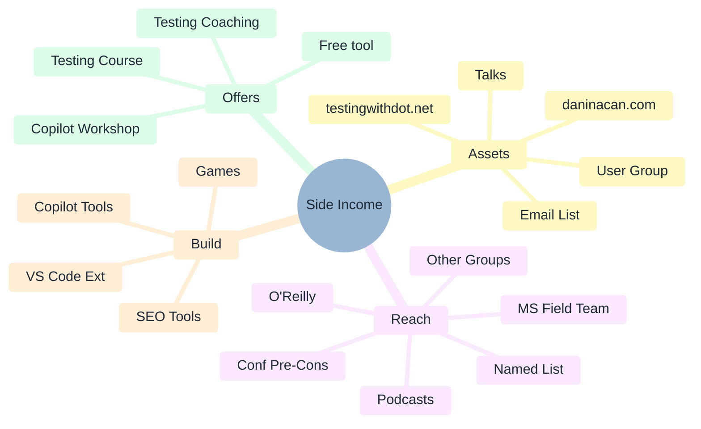

# Side Income: Mind Map

**Generated:** August 31, 2026
**Context:** Brainstorming scratchpad. Seeded with a few branches from the ideation session — deliberately
incomplete. Add, prune, and rearrange freely. Nothing here is a commitment.

Full reasoning lives in [workshop-on-ramp-plan.md](workshop-on-ramp-plan.md) and
[building-plan.md](building-plan.md).

---

---

## Prompts to Push On

Blank space is the point. A few directions worth expanding when the mood strikes:

- **Offers** — what's the *smallest* thing someone could pay for? What's the biggest?
- **Assets** — which of these could feed the email list this month, not someday?
- **Reach** — who specifically? Names, not categories.
- **Build** — which ideas serve people already reachable through an Asset or a Reach branch?
