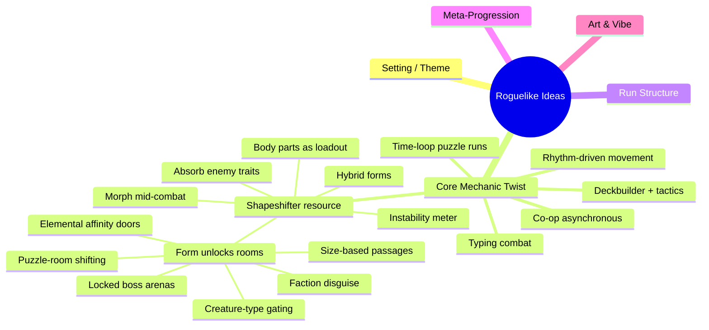

# Brainstorm: Roguelike Video Game Ideas

```mermaid
mindmap
  root((Roguelike Ideas))
    Setting / Theme
    Core Mechanic Twist
      Deckbuilder + tactics
      Typing combat
      Rhythm-driven movement
      Time-loop puzzle runs
      Shapeshifter resource
        Body parts as loadout
        Absorb enemy traits
        Morph mid-combat
        Form unlocks rooms
          Creature-type gating
          Elemental affinity doors
          Size-based passages
          Faction disguise
          Locked boss arenas
          Puzzle-room shifting
        Hybrid forms
        Instability meter
      Co-op asynchronous
    Run Structure
    Meta-Progression
    Art & Vibe
```
